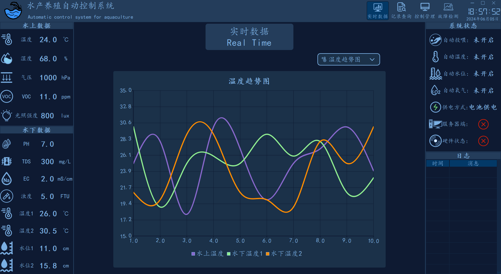
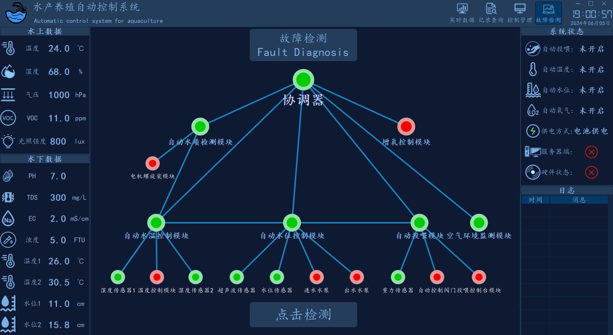
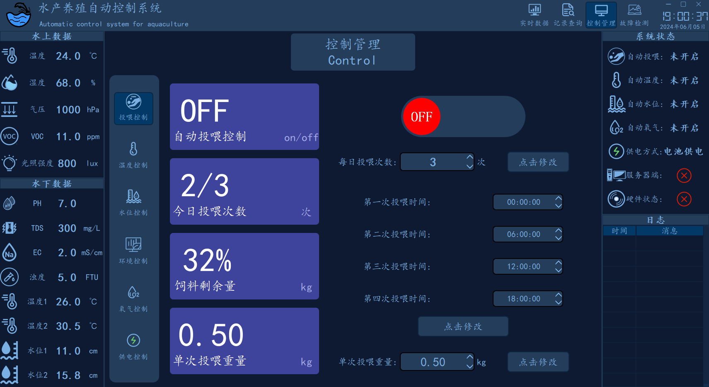
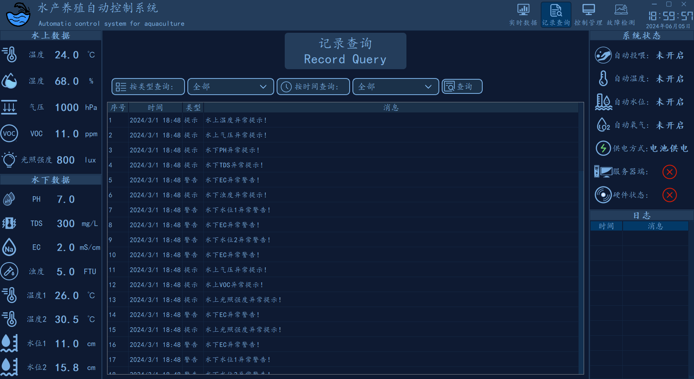
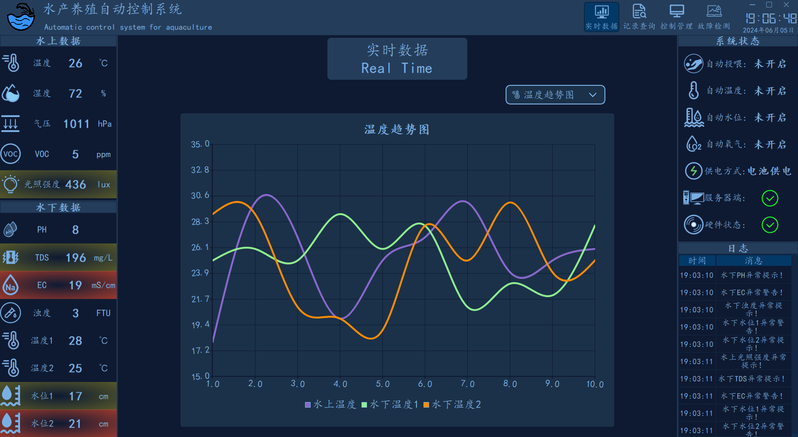
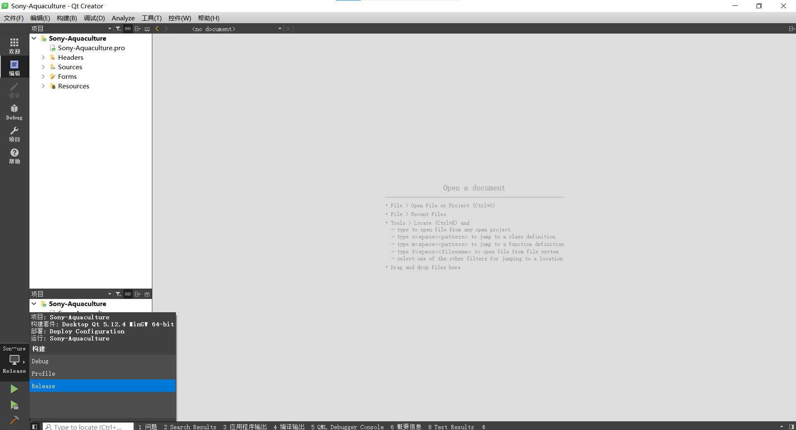

# Sony Aquaculture

Qt Widgets desktop client for aquaculture monitoring and device control.
The application collects sensor values through Modbus RTU, displays real-time
trends and device states, supports control writes, and provides fault and log
views.

## Stack

- C++11
- Qt 5.15 Widgets
- Qt SerialBus and SerialPort
- Qt Charts
- QMYSQL for optional data storage
- qmake and MinGW

## Main Features

- 13-point holding-register polling from the configured Modbus device
- Request queue with FIFO reads, control-write priority, deduplication, and
  latest-value replacement for pending writes
- Worker-thread Modbus communication so serial I/O and response parsing do not
  block the UI thread
- Request-level timeout/retry handling and serial reconnect backoff
- Online, Unstable, Error, and Offline device states
- Good, Stale, and Bad data-quality presentation
- Real-time charts with a bounded sliding window
- Remote control for feeding, temperature, oxygen, water-level, and related
  equipment
- Fault detection, warning display, and log query pages

## Build

Open `Sony-Aquaculture.pro` with a Qt 5.15 MinGW kit and build with qmake.
The project expects the bundled slide-button library under `lib/` and runtime
resources under `ptr/`.

The default serial port in the public configuration is `COM1`. Change
`modbus.ini` for the actual port and device settings. Modbus addresses in the
configuration are zero-based PDU addresses.

## Database Configuration

The database connection is optional for the acquisition path. Configure it
with environment variables instead of placing credentials in source code:

```text
DY_DB_HOST       (default: 127.0.0.1)
DY_DB_USER       (default: root)
DY_DB_PASSWORD   (required for MySQL access)
```

The default database name is `test`.

## Tests

The Modbus tests are under `tests/`. Build them in a separate build directory
with the Qt 5.15 kit:

```sh
qmake ../SonyAquaculture-main/tests/modbus_tests.pro
mingw32-make
```

## Screenshots













This repository is a sanitized publication copy. Credentials and
machine-specific build output are not included.
